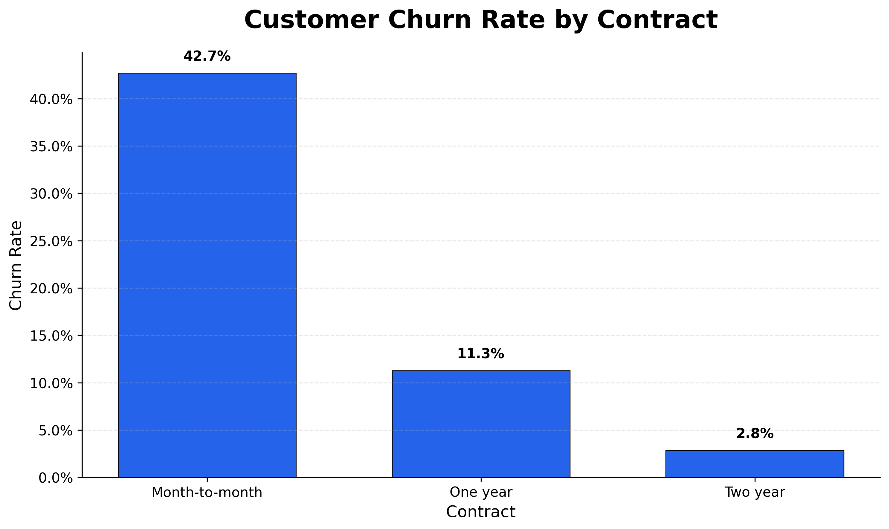
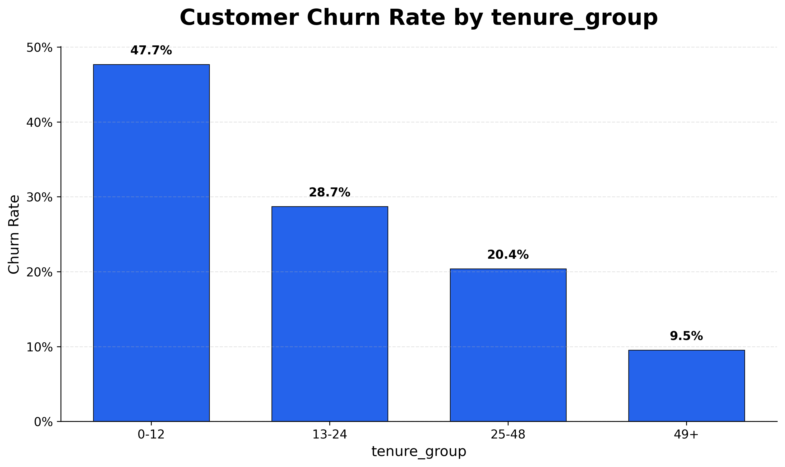
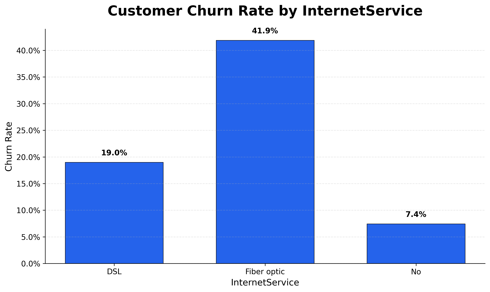
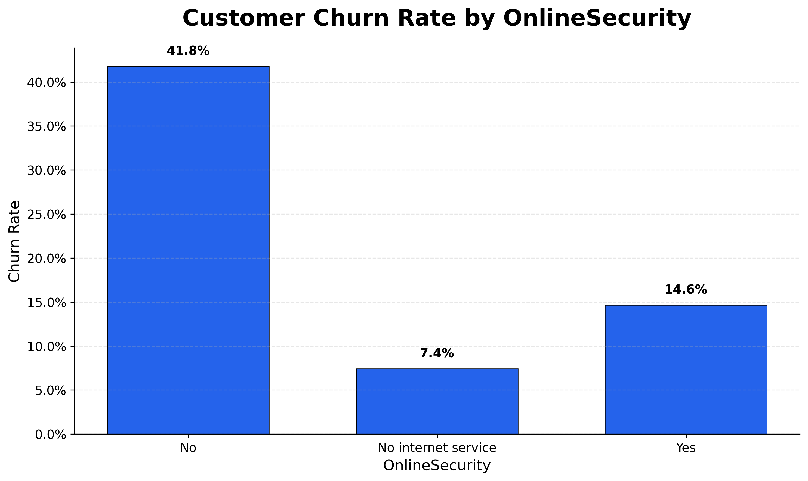
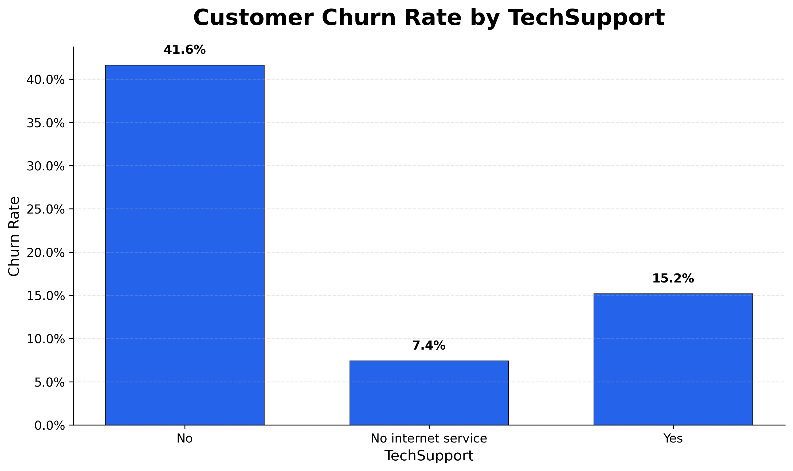
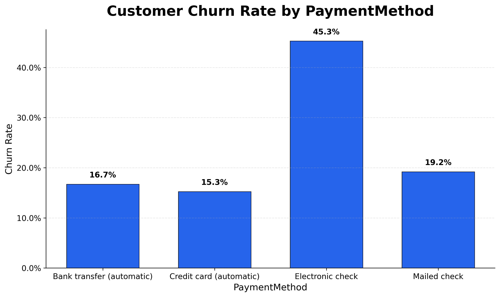

# Milestone 1: Data Ingestion & Exploratory SQL Analysis

## Objective

The objective of this milestone was to clean the Telco Customer Churn dataset, store it in a SQLite database, and perform exploratory data analysis using SQL to identify the key factors associated with customer churn.

---

## Completed

* Loaded the Telco Customer Churn dataset using Pandas.
* Cleaned the dataset by converting `TotalCharges` to a numeric data type and removing invalid records.
* Stored the cleaned dataset in a SQLite database (`churn.db`).
* Built reusable SQL queries to analyze customer churn across multiple business dimensions.
* Created visualizations to summarize the key findings.

---

## Technologies Used

* Python
* Pandas
* SQLite
* SQL
* Matplotlib

---

# Key Business Insights

## 1. Churn Rate by Contract Type

> **Image Path:** `images/churn_by_contract.png`

Customers on **month-to-month contracts** have the highest churn rate (**42.7%**), while customers on **two-year contracts** churn at only **2.8%**. Longer contract commitments are strongly associated with improved customer retention.

---

## 2. Churn Rate by Customer Tenure

> **Image Path:** `images/churn_by_tenure_group.png` 

Customers with **0–12 months** of tenure experience the highest churn rate (**47.7%**). Churn decreases steadily as customer tenure increases, suggesting that the first year is the most critical period for customer retention.

---

## 3. Churn Rate by Internet Service

> **Image Path:** `images/churn_by_internetservice.png`

Customers using **Fiber Optic** internet service exhibit substantially higher churn than customers using DSL or those without internet service, indicating a segment that warrants further investigation.

---

## 4. Churn Rate by Online Security

> **Image Path:** `images/churn_by_onlinesecurity.png`

Customers **without Online Security** have a churn rate of approximately **41.8%**, considerably higher than customers who subscribe to the service. This suggests that value-added services may improve customer retention.

---

## 5. Churn Rate by Tech Support

> **Image Path:** `images/churn_by_techsupport.png`

Customers without **Tech Support** experience a churn rate of approximately **41.6%**, indicating that customer support plays an important role in reducing churn.

---

## 6. Churn Rate by Payment Method

> **Image Path:** `images/churn_by_paymentmethod.png`

Customers paying via **Electronic Check** have the highest churn rate (**45.3%**) among all payment methods, making this customer segment a strong candidate for targeted retention strategies.

---

# Summary

The exploratory SQL analysis identified several strong indicators of customer churn:

* Month-to-month contracts are associated with significantly higher churn.
* New customers (0–12 months tenure) are at the greatest risk of leaving.
* Customers without Tech Support or Online Security churn substantially more often.
* Fiber Optic customers exhibit elevated churn compared to other internet service types.
* Electronic Check users have the highest churn rate among all payment methods.

These insights establish a strong business understanding of the dataset and provide the foundation for the machine learning phase of the project.

---

# Next Steps

The next milestone focuses on preparing the dataset for machine learning by:

* Encoding categorical variables.
* Preparing numerical features.
* Splitting the dataset into training and testing sets.
* Scaling numerical features.
* Building the first customer churn prediction model.
