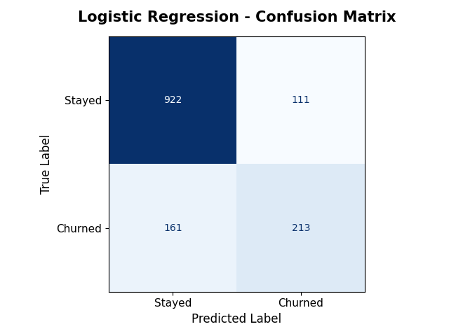

# Milestone 3 — Baseline Model: Logistic Regression

## Objective

The objective of this milestone was to build the first machine learning model capable of predicting customer churn using the preprocessed Telco Customer Churn dataset. Logistic Regression was selected as the baseline model due to its simplicity, interpretability, and effectiveness for binary classification problems.

---

## Model Selection

Logistic Regression is a supervised machine learning algorithm designed for binary classification tasks. It estimates the probability that a customer belongs to one of two classes:

* Stayed
* Churned

This model serves as a benchmark against which more complex models can later be compared.

---

## Training Procedure

The model was trained using the processed training dataset produced during Milestone 2.

### Model Configuration

| Hyperparameter              | Value |
| --------------------------- | ----: |
| Regularization Strength (C) |   0.1 |
| Penalty                     |    L2 |
| Solver                      | lbfgs |
| Maximum Iterations          |  1000 |
| Random State                |    42 |

After training, predictions were generated using the unseen test dataset.

---

# Model Evaluation

The following metrics were used to evaluate model performance:

| Metric    |      Score |
| --------- | ---------: |
| Accuracy  | **80.67%** |
| Precision | **65.74%** |
| Recall    | **56.95%** |
| F1-score  | **61.03%** |

The model achieved an overall accuracy of approximately **81%**, indicating good predictive performance on unseen data.

---

# Confusion Matrix

---

## Classification Report

| Class   | Precision | Recall | F1-score | Support |
| ------- | --------: | -----: | -------: | ------: |
| Stayed  |      0.85 |   0.89 |     0.87 |    1033 |
| Churned |      0.66 |   0.57 |     0.61 |     374 |

| Overall Metric      |    Value |
| ------------------- | -------: |
| Accuracy            | **0.81** |
| Macro Average F1    | **0.74** |
| Weighted Average F1 | **0.80** |

---

## Results Interpretation

The Logistic Regression model demonstrated strong overall predictive performance.

Key observations include:

* The model correctly classified the majority of customers who remained with the company.
* Churn predictions achieved a precision of **65.74%**, indicating that approximately two-thirds of customers predicted to churn actually did.
* The recall of **56.95%** shows that the model successfully identified more than half of the customers who eventually churned.
* The F1-score of **61.03%** reflects a balanced trade-off between precision and recall.

Although the model performed well overall, predicting churn remained more challenging than predicting customer retention due to the class imbalance present in the dataset.

---

## Conclusion

This milestone established a strong baseline machine learning model for customer churn prediction. Logistic Regression achieved approximately **81% accuracy** while maintaining a reasonable balance between precision and recall.

The baseline results obtained in this milestone provide a reference point for evaluating more advanced models in the following milestones, where Decision Trees, Random Forests, Support Vector Machines, and hyperparameter tuning will be explored to determine whether improved predictive performance can be achieved.
